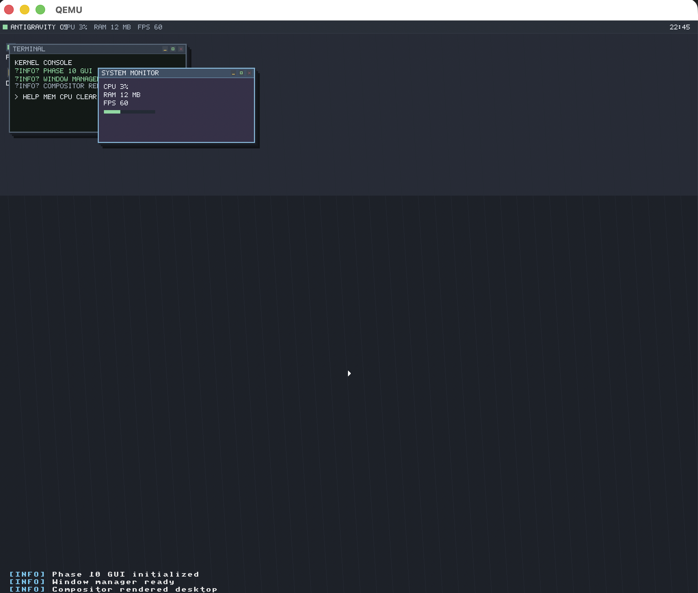

# UEFI Boot System

<p align="center">
  
</p>

<p align="center">
  <em>Preview of the operating system after booting through the custom UEFI bootloader.</em>
</p>

This project builds a simple UEFI bootloader and kernel, then runs them in QEMU using an EFI system partition image.

## Project structure
- `bootloader/` — UEFI bootloader sources
- `kernel/` — kernel sources
- `scripts/` — helper scripts for setup, build, and run
- `ESP/` — generated EFI filesystem contents
- `build/` — generated build artifacts

## Prerequisites
Make sure the following tools are available:
- CMake
- Clang/LLVM
- QEMU
- x86_64-w64-mingw32 cross-compiler
- x86_64-elf-ld
- OVMF/EDK2 UEFI firmware image

## Quick start
1. Run Step 1 setup:
   ```bash
   ./scripts/setup_step1.sh
   ```
2. Run Step 2 build:
   ```bash
   ./scripts/setup_step2.sh
   ```
3. Run Step 3 launch:
   ```bash
   ./scripts/setup_step3.sh
   ```

## Manual scripts
- `./scripts/build.sh` — configure and build the bootloader and kernel
- `./scripts/run.sh` — prepare the EFI image and launch QEMU
- `./scripts/setup_step1.sh` — check required tools and permissions
- `./scripts/setup_step2.sh` — run the build workflow
- `./scripts/setup_step3.sh` — launch the project in QEMU

## Command reference
```bash
# Step 1: verify environment
./scripts/setup_step1.sh


# Step 2: build the project
./scripts/setup_step2.sh

# Step 3: run the project
./scripts/setup_step3.sh

# Direct build
./scripts/build.sh

# Direct run
./scripts/run.sh

# Direct teste
./scripts/test.sh

# Make scripts executable if needed
chmod +x scripts/*.sh
```

## Notes
- The build script clears the previous CMake build directory to avoid stale cache issues.
- The run script creates an EFI system partition image and boots it through QEMU using OVMF firmware.